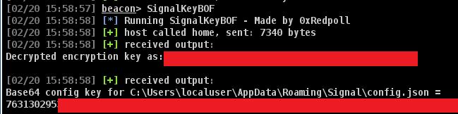

# SignalKeyBOF

A Cobalt Strike BOF and Python helper script to retrieve the decryption keys for the compromised hosts Signal Desktop database.

> [!WARNING]
> Only works on Windows hosts with Signal Desktop installed and used.

## Requirements
- A Cobalt Strike beacon on a compromised host
- Python packages (which I haven't kept track of, requirements.txt to come)

## Build Info

  ```make all```

## Usage
  SignalKeyBOF



## License

[//]: # (If you change the License type, be sure to change the actual LICENSE file as well)
GPLv3

## Author Information

This tool was created by [0xRedpoll](https://github.com/0xRedpoll).
